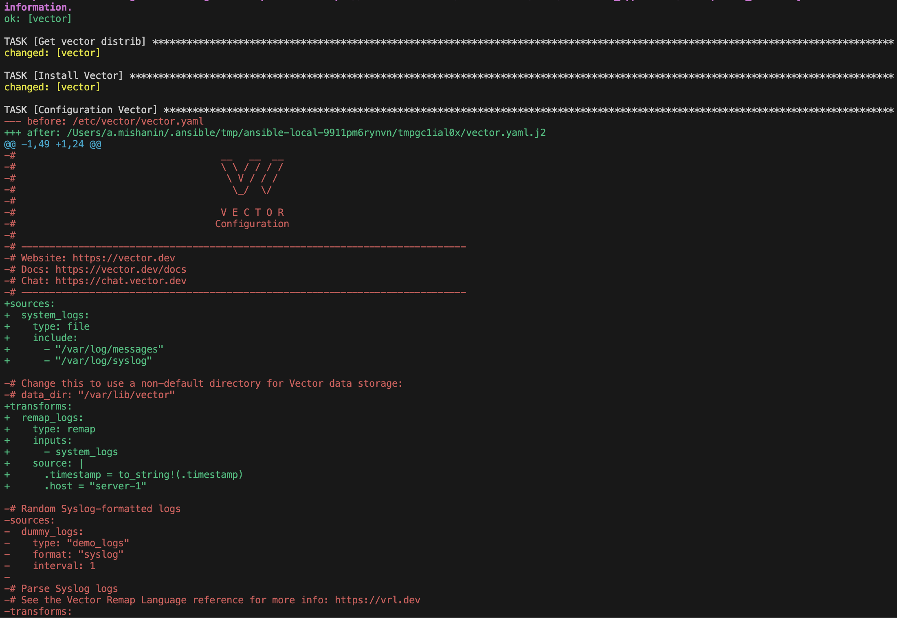

# Домашнее задание к занятию 2 «Работа с Playbook»

## Подготовка к выполнению

1. * Необязательно. Изучите, что такое [ClickHouse](https://www.youtube.com/watch?v=fjTNS2zkeBs) и [Vector](https://www.youtube.com/watch?v=CgEhyffisLY).
2. Создайте свой публичный репозиторий на GitHub с произвольным именем или используйте старый.
3. Скачайте [Playbook](./playbook/) из репозитория с домашним заданием и перенесите его в свой репозиторий.
4. Подготовьте хосты в соответствии с группами из предподготовленного playbook.

## Основная часть

1. Подготовьте свой inventory-файл `prod.yml`.
2. Допишите playbook: нужно сделать ещё один play, который устанавливает и настраивает [vector](https://vector.dev). Конфигурация vector должна деплоиться через template файл jinja2. От вас не требуется использовать все возможности шаблонизатора, просто вставьте стандартный конфиг в template файл. Информация по шаблонам по [ссылке](https://www.dmosk.ru/instruktions.php?object=ansible-nginx-install). не забудьте сделать handler на перезапуск vector в случае изменения конфигурации!
3. При создании tasks рекомендую использовать модули: `get_url`, `template`, `unarchive`, `file`.
4. Tasks должны: скачать дистрибутив нужной версии, выполнить распаковку в выбранную директорию, установить vector.
5. Запустите `ansible-lint site.yml` и исправьте ошибки, если они есть.
6. Попробуйте запустить playbook на этом окружении с флагом `--check`.
7. Запустите playbook на `prod.yml` окружении с флагом `--diff`. Убедитесь, что изменения на системе произведены.
8. Повторно запустите playbook с флагом `--diff` и убедитесь, что playbook идемпотентен.
9. Подготовьте README.md-файл по своему playbook. В нём должно быть описано: что делает playbook, какие у него есть параметры и теги. Пример качественной документации ansible playbook по [ссылке](https://github.com/opensearch-project/ansible-playbook). Так же приложите скриншоты выполнения заданий №5-8
10. Готовый playbook выложите в свой репозиторий, поставьте тег `08-ansible-02-playbook` на фиксирующий коммит, в ответ предоставьте ссылку на него.

---

### Как оформить решение задания

Выполненное домашнее задание пришлите в виде ссылки на .md-файл в вашем репозитории.

---

### Ответ

Запустите `ansible-lint site.yml` и исправьте ошибки, если они есть.


Попробуйте запустить playbook на этом окружении с флагом `--check`.


Запустите playbook на `prod.yml` окружении с флагом `--diff`. Убедитесь, что изменения на системе произведены.



Повторно запустите playbook с флагом `--diff` и убедитесь, что playbook идемпотентен.


## Проект Clickhouse-Vector

Репозиторий для выполнения домашнего задания

## Версия

  08-ansible-02-playbook
  
## Условия установки

* **Ansuble 2.10+**

## Настройка

Ссылка на файлы для изменнения значений по умолчанию

* [playbook/group_vars/clickhouse/vars.yml](playbook/group_vars/clickhouse/vars.yml)

* [playbook/group_vars/vector/vars.yml](playbook/group_vars/vector/vars.yml)

Например, если нам нужно поменять версию дистрибутивов Clickhouse

        clickhouse_version: "24.9.2.42"

В файле [playbook/inventory/prod.yml](playbook/inventory/prod.yml), вы можете описать детали узла. В этом файле узлы разделены на две группы `vector` и `clichouse`.
`ansible_host` используется  ansible-ом для соединения узлов с целью запуска сценария. `ansible_user` используется для определения от какого пользователя будет осуществленно соединение.

Пример:

```
   vector:
      hosts:
        vector:
          ansible_host: 10.1.137.5
          ansible_user: admin1
```

## Установка

Для развертывания с помощью ansible playbook выполнить следующую команду:

`ansible-playbook -i inventory/prod.yml site.yml`
